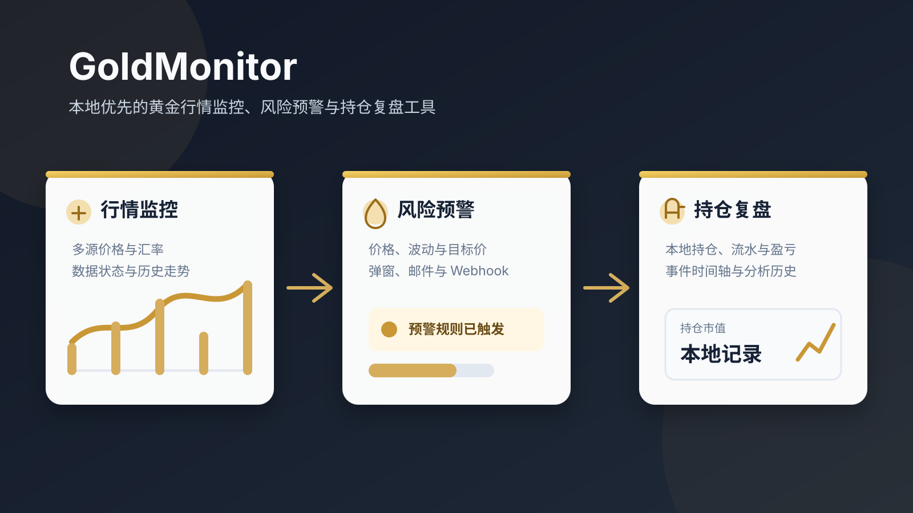

# GoldMonitor

<p align="center">
  
</p>

<p align="center">本地优先的黄金行情监控、风险预警与持仓复盘桌面工具。</p>

<p align="center">
  <a href="https://github.com/JunCxio/GoldMonitor/releases/latest">下载最新版本</a> ·
  <a href="#快速开始">快速开始</a> ·
  <a href="CONTRIBUTING.md">参与贡献</a> ·
  <a href="https://github.com/JunCxio/GoldMonitor/issues/new/choose">提交反馈</a>
</p>

<p align="center">
  <a href="https://github.com/JunCxio/GoldMonitor/releases"></a>
  <a href="LICENSE"></a>
  <a href="https://github.com/JunCxio/GoldMonitor/actions/workflows/ci.yml"></a>
</p>

GoldMonitor 面向希望在本机持续观察金价、管理持仓并复盘交易决策的用户。数据和配置默认保存在本地；风险分析仅在用户手动触发时调用已配置的模型服务。



## 适合的使用场景

- 需要同时查看国际金价、人民币克价与 USD/CNY 汇率，并掌握数据来源和更新时间。
- 希望按价格、短时波动或目标价接收桌面、邮件或 Webhook 提醒。
- 需要在本地维护黄金持仓、流水、风险分析历史和复盘记录。
- 希望使用免费、可审查、可自行构建的桌面工具，而不是把配置和历史上传到云端。

## 主要功能

- 实时获取 XAU/USD、人民币克价和 USD/CNY 汇率，展示数据源、更新时间、缓存状态和日内统计。
- 支持上涨、下跌、关键价位和短时波动提醒，可分别控制弹窗、声音和邮件通知。
- 支持预警策略模板，可保存价格阈值、波动提醒、冷却、静默和通知级别，并按场景一键切换。
- 支持目标价观察清单，可维护多个人民币克价或国际金价目标，触发后进入现有警报记录和通知链路。
- 支持持仓看板，可维护人民币克价和国际金价持仓，展示成本、市值、浮动盈亏，并导出 CSV。
- 警报记录会显示邮件和 Webhook 的通知投递状态，便于排查通知是否触发。
- 警报记录支持本地保存、新警报计数、通知异常重发、搜索筛选、CSV 导出到固定导出目录和一键清空。
- 支持提醒冷却时间、静默时段、邮件标题模板和正文模板。
- 支持 Webhook 通知，可按预警级别控制是否发送。
- 支持本地每日摘要调度，可按设定时间通过邮件或 Webhook 汇总最近 24 小时的价格、预警、风险分析、新闻、复盘笔记、数据质量和持仓；程序当天晚启动时会补发，摘要不会自动调用模型。
- 支持桌面金价悬浮条，显示涨跌颜色、更新时间和数据源状态，并提供右键菜单。
- macOS 桌面版支持菜单栏金价、菜单栏打开主窗口、刷新行情、风险分析、通知中心提醒和系统提示音。
- 支持风险分析助手，用户手动触发，避免后台自动消耗模型 token。
- 风险分析支持 DeepSeek 和 OpenAI 兼容接口，支持模型列表下拉、连接测试、分析深度、缓存、历史、复制和导出报告。
- 可从本地风险分析历史选择两条结果并排比较；对比选择不持久化，且不会新增模型调用。
- 金价与汇率请求通过内部统一的行情源适配器接口组织，现有 4 个金价源和 3 个汇率源保持固定优先级与原有回退顺序。
- 支持数据源健康面板，展示行情源、汇率源、缓存回退、失败原因和响应耗时。
- 支持本地价格历史 SQLite 持久化、历史复盘、事件时间轴、图表事件标记、CSV 导出和本地复盘报告导出。
- 支持在事件时间轴新增、编辑和删除本地复盘笔记，可独立记录或关联具体事件，并随现有复盘报告一并导出。
- 支持配置导出、配置导入、恢复默认设置、诊断报告导出和自定义导出目录；配置备份使用 schema v1，导入兼容无版本字段的旧版 v0 备份。
- 支持软件更新检查、下载进度、SHA256 校验、安装器启动和内置 GitHub Release 官方更新源。

## 扩展边界

当前版本聚焦本地黄金行情监控、持仓管理、提醒通知和复盘分析。多品种贵金属、更多通知渠道、局域网只读面板和云同步属于后续扩展方向，启动前需先满足 `docs/product-discovery/extension-readiness-checklist.md` 中的模块边界、数据能力、核心闭环和行情可信度前置条件。

行情源适配器是内部扩展接口，用于统一数据源元数据、请求结果和健康状态目录。当前版本不向用户开放数据源排序或禁用设置，也不改变实际请求来源、请求参数和失败回退顺序；新增或替换数据源时仍需通过解析、优先级、缓存和健康状态契约验证。

## 快速开始

最新安装包发布在 GitHub Releases：

```text
https://github.com/JunCxio/GoldMonitor/releases/latest
```

Windows 用户通常只需要下载 `GoldMonitorSetup.exe` 并运行安装。安装包是按用户目录安装，不需要管理员权限。

macOS 用户可下载 `GoldMonitor-macOS.dmg`，打开后把 `GoldMonitor.app` 拖入“应用程序”目录即可安装。macOS 版会在菜单栏显示状态项，关闭主窗口后仍可从菜单栏恢复。

## 更新源

程序内置 GitHub Release 官方更新源，普通用户无需在设置页查看或修改具体地址。

更新清单由 GitHub Actions 在发布时自动生成，包含：

- `version`：最新版本号。
- `url`：安装包下载地址。
- `sha256`：安装包 SHA256 校验值。
- `notes`：当前版本说明。

程序会按内置更新源每 6 小时检查一次新版本；发现可用更新后，会在主界面的更新按钮上显示状态。更新安装完成后，安装器会自动重新打开程序。旧版本本地配置中保存过的 `update_manifest_url` 和 `update_auto_check_interval_hours` 会被忽略并在下次保存设置时移除。

## 本地数据

配置和运行数据默认保存在以下目录：

- Windows：`%APPDATA%\GoldMonitor`
- macOS：`~/Library/Application Support/GoldMonitor`

其中包括：

- `settings.json`：通用设置、邮件通知、Webhook 通知和风险分析设置。
- `thresholds.json`：价格阈值和波动提醒配置。
- `alert_profiles.json`：预警策略模板，保存价格阈值、波动提醒和提醒行为白名单，不包含 SMTP、Webhook URL 或密钥。
- `watch_targets.json`：目标价观察清单。
- `portfolio_positions.json`：本地持仓记录。
- `market_cache.json`：最近可用金价与汇率缓存。
- `price_history.json`：本地价格历史。
- `price_history.sqlite3`：本地价格历史主存储。
- `alert_log.sqlite3`：本地警报记录主存储。
- `risk_analysis_history.json`：风险分析历史。
- `review_notes.json`：本地复盘笔记，最多保存 500 条；单条标题最多 80 个字符、正文最多 2000 个字符，可选关联时间轴事件。
- `daily_digest_state.json`：每日摘要最近执行与发送状态，用于避免同一天重复发送；手动测试发送不会占用当天的计划发送资格。
- `exports/`：默认导出目录，可在设置页修改。桌面版支持通过系统目录选择器设置路径，浏览器模式可手动输入路径；保存导出目录时会检查目录是否可写。配置备份、诊断报告和复盘报告会保存到当前导出目录。复盘报告基于本地历史、警报、风险分析历史、复盘笔记、新闻缓存和数据状态生成，不会自动调用模型。
- `GoldMonitor.log`：运行日志。

SMTP 授权码、DeepSeek API Key 和 OpenAI 兼容接口 API Key 会优先保存到系统凭据存储：

- Windows：Credential Manager。
- macOS：Keychain。

配置备份不包含敏感字段，也不包含“已配置”或掩码值等状态衍生字段；诊断报告只包含敏感字段的配置状态，不包含原文密钥。旧版本中已经写入 `settings.json` 的敏感字段会在下次保存设置时迁移到系统凭据存储。

配置备份当前使用 schema v1。无 `schema_version` 字段的旧备份按 v0 处理，导入预检会明确提示并在确认导入时迁移；高于当前支持版本或版本字段非法的备份会在预检阶段被拒绝，不会写入配置。

重新安装程序通常不会删除这些配置。卸载或手动删除 `%APPDATA%\GoldMonitor` 后，本地配置和历史才会丢失。

## 本地开发

macOS 可双击根目录中的 `GoldMonitor.command` 启动浏览器模式，也可以在终端运行：

```bash
./scripts/start_mac.sh
```

脚本会创建 `.venv`，安装 Flask、Flask-SocketIO 和 requests，并把本地数据写入 `~/Library/Application Support/GoldMonitor`。源码目录下的 macOS 启动方式默认使用浏览器模式；Release 中的 `.app` 会以桌面窗口启动。

```powershell
py -3.12 -m venv .venv
.\.venv\Scripts\pip.exe install -r requirements.txt -r requirements-build.txt -c constraints\windows-py312.txt
```

```bash
python3.12 -m venv .venv
.venv/bin/pip install -r requirements.txt -r requirements-build.txt -c constraints/macos-py312.txt
```

上述命令使用当前平台的 Python 3.12 constraints，确保本地与 CI/Release 的依赖版本一致。依赖锁定更新规则参见 [贡献指南](CONTRIBUTING.md#更新依赖锁定)。

运行完整检查：

Windows：

```powershell
.\.venv\Scripts\python.exe scripts\run_checks.py
```

macOS：

```bash
.venv/bin/python scripts/run_checks.py
```

该入口会执行 Python 语法检查、现有契约检查和完整 pytest；Windows 还会执行 PowerShell 契约检查。贡献要求参见 [贡献指南](CONTRIBUTING.md)。

## 本地打包

```powershell
.\.venv\Scripts\pyinstaller.exe --clean --noconfirm GoldMonitor.spec
.\.tools\InnoSetup6\ISCC.exe .\installer\GoldMonitor.iss
```

```bash
PYTHON_BIN=.venv/bin/python ./scripts/build_macos_dmg.sh
```

构建结果：

- Windows 程序目录：`dist\GoldMonitor`
- Windows 安装包：`release\GoldMonitorSetup.exe`
- macOS 安装包：`release\GoldMonitor-macOS.dmg`

## 发布流程

发布前必须同步三处版本：

- `app.py` 中的 `APP_VERSION`
- `installer/GoldMonitor.iss` 中的 `MyAppVersion`
- `CHANGELOG.md` 中对应版本的变更内容

推送版本标签会触发 GitHub Actions 自动发布：

```powershell
git tag v1.0.0
git push origin main
git push origin v1.0.0
```

GitHub Actions 会执行检查、构建 Windows EXE 和 macOS DMG、生成 `version.json`，并把 `GoldMonitorSetup.exe`、`GoldMonitor-macOS.dmg` 与 `version.json` 上传到对应 Release。

发布完成后，GitHub Actions 会继续运行发布资产验收，自动下载 `version.json`、Windows 安装包和 macOS DMG，并校验版本、下载地址和 SHA256。

如果 `CHANGELOG.md` 中缺少当前版本说明，发布流程会失败。

## 参与贡献

开发环境、测试要求、Commit 和 Pull Request 规范参见 [贡献指南](CONTRIBUTING.md)。

## 安全问题

安全漏洞不要提交公开 Issue，请按照 [安全策略](SECURITY.md) 使用私密报告入口。

## 许可证

GoldMonitor 使用 [MIT License](LICENSE) 发布。
